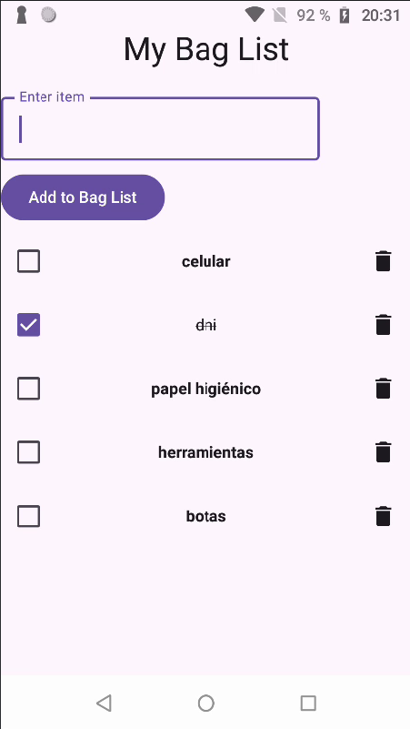

# Bag List

The project aims to remember the important things to carry in your bag.



## For building the app
```

```
The location will be:
`\bag_list\app\build\outputs\apk\debug\app-debug.apk`

## For signing the app
<!-- ```
keytool -genkey -v -keystore <PATH_TO_SAVE>\my-release-key.jks -keyalg RSA -keysize 2048 -validity 10000 -alias my-key-alias
``` -->

## Libs used 

<!-- 1. [TEXT](LINK) -->